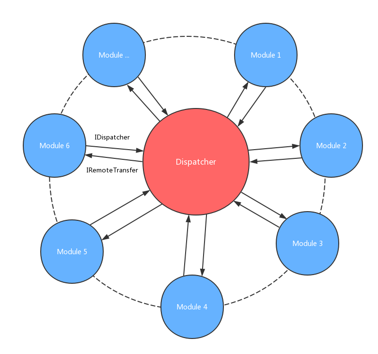

# 项目简介

StarBridge提供了接口式的组件间通信管理，包括同进程的本地接口调用和跨进程调用。



**注:之所以分成本地服务和远程服务这两种，是由于本地服务的接口可以传递各种类型的参数和返回值，而远程接口则受AIDL的限制，参数和返回值只能是基本类型或者实现了Parcelable接口的自定义类型。**

StarBridge的主要特色如下:

+ 由于StarBridge是在AIDL的基础上进行改造，所以在保证了互操作性的基础上，同时又使得任意两个模块间的IPC调用变得异常简单。优化点包括:
    - 无需创建连接。传统的IPC方式，如果n个模块间需要两两通信，那么就需要创建C(n,2)个连接，而使用StarBridge, 不需要任何bindService()操作即可获取对方的IBinder
    - 同步获取服务。抛弃了bindService()这种异步获取的方式，改造成了同步获取
    - 生命周期自动管理(详情见[wiki](http://gitlab.qiyi.domain/wanglonghai/ServiceManager/wikis/%E7%94%9F%E5%91%BD%E5%91%A8%E6%9C%9F%E8%87%AA%E5%8A%A8%E7%AE%A1%E7%90%86))
    
+ 透明依赖，提供注解的方式来注册和获取服务，无需显式依赖StarBridge的代码，而是在编译时注入代码，便于方案切换，特别是对于既要做插件又要做独立APK的业务很友好

+ 采用"接口+数据结构"的方式来实现组件间通信，这种方式相比协议的方式在于实现简单，使用方便，无需定义大量的java bean, 维护也更简单

+ 支持IPC的Callback，并且支持跨进程的事件总线

+ 接口的版本兼容性管理，各个版本的接口变动会使得接口文件的deprecated越来越臃肿，难以维护，StarBridge的“滚木移石”方案比较优雅的解决了此问题（详细见[wiki](http://gitlab.qiyi.domain/wanglonghai/ServiceManager/wikis/%E6%8E%A5%E5%8F%A3%E5%85%BC%E5%AE%B9%E6%80%A7%E7%AE%A1%E7%90%86---%E6%BB%9A%E6%9C%A8%E7%A7%BB%E7%9F%B3）)    

**注意这里的服务不是Android中四大组件的Service,而是指提供的接口与实现。为了表示区分，后面的服务均是这个含义，而Service则是指Android中的组件。**

StarBridge和其他组件间通信方案的对比如下:

|       |    使用方便性     | 代码侵入性  |   互操作性    |  是否支持IPC   |  是否支持跨进程事件总线  |  是否支持页面跳转  |
| :---: | :-------: | :----------: |:----------: |:----------: |:----------: |:----------: |
| StarBridge |  好     |   较小     |    好    |    Yes    |   Yes    |   No     |
| DDComponentForAndroid |  较差      |   较大     |    差    |   No     |   No    |   Yes     |
| ARouter |  较好      |   较大     |    差    |   No     |   No    |    Yes    |


# 接入方式
## 普通接入方式
首先添加maven路径:
```groovy
    allprojects {
        repositories {
            google()
            jcenter()
    
            maven{
                url 'http://maven.mbd.qiyi.domain/nexus/content/repositories/mcg-arch'
            }
        }
    }
```
其实是添加gradle依赖:
```groovy
    implementation 'org.qiyi.video.svg:svglib:0.7.0'
```
**注:这里具体是采用implementation,api,compileOnly中的哪一种，需要结合具体的使用场景，比如如果是在一个独立的App中使用，则使用api; 
反之，如果是在一个组件中使用(比如爱奇艺的Download组件),那么使用compileOnly即可。**

目前对外的接口是StarBridge，业务方接入只需要跟这个类打交道。

## 使用注解接入
如果想要使用注解接入的话，则需要添加如下依赖:
```groovy
    implementation 'org.qiyi.video.svg:annotation:0.7.0'
    annotationProcessor 'org.qiyi.video.svg:compiler:0.7.0'
```
同时在app下的build.gradle中应用插件:
```groovy
   apply plugin: 'org.qiyi.apple.plugin'
```

# 使用方式
## 初始化
最好是在自己进程的Application中进行初始化(每个进程都有自己的StarBridge对象)，代码如下:
```java
    StarBridge.init(Context);
```
如果不能在Application中进行初始化(比如没有自己的Application),那么至少要保证在使用之前进行初始化。
**另外，不用担心StarBridge多次初始化的问题，在任一进程中，只有首次初始化有效，后面的初始化会自动忽略**。

## 本地服务的注册与使用
### 本地接口定义与实现
本地接口定义与实现这方面，和普通的接口定义、实现没什么太大区别，不一样的地方就两个:
+ 对外接口需要要暴露出去，使其对项目中的所有模块都可见，比如对于爱奇艺基线来说，可放在basecore中
+ 如果对于某个接口有多个实现，那么需要根据业务需求在不同的时候注册不同的实现到StarBridge,不过需要注意的是，同一时间StarBridge中只会有一个实现

### 本地服务注册
本地服务的注册有两种方法，一种是直接调用接口的全路径名和接口的实现，如下:
```java
    StarBridge.getInstance().registerLocalService(ICheckApple.class.getCanonicalName(),CheckAppleImpl.getInstance());
```
还有一种是调用接口class和接口的实现，其实在内部也是获取了它的全路径名,如下:
```java
    StarBridge.getInstance().registerLocalService(ICheckApple.class,CheckAppleImpl.getInstance());
```
其中ICheckApple.class为接口，虽然也可以采用下面这种方式注册:
```java
    StarBridge.getInstance().registerLocalService("wang.imallen.blog.moduleexportlib.apple.ICheckApple",CheckAppleImpl.getInstance());
```
**但是考虑到混淆问题，非常不推荐使用这种方式进行注册**，除非双方能够协商一致使用这个key(因为实际上StarBridge只需要保证有一个唯一的key与该服务对应即可).

### 使用注解进行本地接口注册
仍然以ICheckApple这个掊口及其实现为例，使用接口的话，为了与接口的具体实现和赋值解耦，需要在类中(比如RegLocalServiceByAnnoActivity类)先声明一个成员,并且加上@LBind这个注解:
```java
    @LBind(ICheckApple.class)
    private ICheckApple checkApple;
```
注意，**如果是用要注册的接口进行类型声明，那么这里@LBind也可以不赋值，此时注解处理器会自己查找成员的类型**。

然后对checkApple进行赋值，比如在onStart()中:
```java
    checkApple = CheckAppleImpl.getInstance();
```
然后在它要被注册的方法上加上@LRegister注解,比如想在onStart()中注册，那就加上注解,最后变成:
```java
    @LRegister(ICheckApple.class)
    @Override
    protected void onStart() {
        super.onStart();
        checkApple = CheckAppleImpl.getInstance();
    }
```
注意这里**checkApple也可以在其他方法中赋值，只要保证在onStart()结束之前赋值就可以，因为代码会插入到onStart()方法的末尾**。
详细情况可参考demo中的[RegLocalServiceByAnnoActivity](http://gitlab.qiyi.domain/wanglonghai/ServiceManager/blob/master/app/src/main/java/wang/imallen/blog/servicemanager/annotation/local/RegLocalServiceByAnnoActivity.java)这个示例。

### 本地服务使用
注册完之后，与服务提供方同进程的任何模块都可以调用该服务,获取服务的方式与注册对应，也有两种方式，一种是通过接口的class获取,如下:
```java
    ICheckApple checkApple = (ICheckApple) StarBridge.getInstance().getLocalService(ICheckApple.class);
```
还有一种方法是通过接口的全路径名获取，如下:
```java
    ICheckApple checkApple = (ICheckApple) StarBridge.getInstance().getLocalService(ICheckApple.class.getCanonicalName());
```
与注册类似，仍然不推荐使用如下方式来获取，除非双方始终协商好使用一个唯一的key（但是这样对于新的调用方或者新加入的开发者不友好，容易入坑):
```java
    ICheckApple checkApple = (ICheckApple) StarBridge.getInstance().getLocalService("wang.imallen.blog.moduleexportlib.apple.ICheckApple");
```
具体使用，可以察看applemodule中[LocalServiceDemo](http://gitlab.qiyi.domain/wanglonghai/ServiceManager/blob/master/applemodule/src/main/java/wang/imallen/blog/applemodule/LocalServiceDemo.java)这个Activity。

### 使用注解注入本地服务
注入本地服务使用到的注解是@LInject和@LGet,其中前者用于修饰要被赋值的成员，后者用于修饰方法。
使用方法很简单，请参考[UseLocalServiceByAnnoActivity](http://gitlab.qiyi.domain/wanglonghai/ServiceManager/blob/master/app/src/main/java/wang/imallen/blog/servicemanager/annotation/local/UseLocalServiceByAnnoActivity.java)这个示例即可。

### 本地接口的Callback问题
如果是耗时操作，由本地接口自己定义Callback接口，调用方在调用接口时传入Callback对象即可。

## 远程服务的注册与使用
远程服务的注册与使用略微麻烦一点，因为需要像实现AIDL Service那样定义aidl接口。
### 远程接口的定义与实现
定义aidl接口，并且要将编译生成的Stub和Proxy类暴露给所有模块, 类似的，也是放在basecore中，以暴露给其他模块使用。比如定义一个购买苹果的服务接口:
```aidl
    package wang.imallen.blog.moduleexportlib.apple;
    import org.qiyi.video.svg.IPCCallback;
    
    interface IBuyApple {
        int buyAppleInShop(int userId);
        void buyAppleOnNet(int userId,IPCCallback callback);
    }
```

而接口的实现如下:
```java
public class BuyAppleImpl extends IBuyApple.Stub {

    private static BuyAppleImpl instance;

    public static BuyAppleImpl getInstance() {
        if (null == instance) {
            synchronized (BuyAppleImpl.class) {
                if (null == instance) {
                    instance = new BuyAppleImpl();
                }
            }
        }
        return instance;
    }

    private BuyAppleImpl() {
    }

    @Override
    public int buyAppleInShop(int userId) throws RemoteException {
       ...
    }

    @Override
    public void buyAppleOnNet(int userId, IPCCallback callback) throws RemoteException {
       ...
    }

}

```

### 远程服务的注册
与本地接口的注册略有不同，远程接口注册的是继承了Stub类的IBinder部分，注册方式有传递接口Class和接口全路径名两种，如下:
```java
    StarBridge.getInstance().registerRemoteService(IBuyApple.class, BuyAppleImpl.getInstance().asBinder());
```
其中BuyAppleImpl是继承了IBuyApple.Stub类的具体实现类,另外，其实这里写成下面这样其实也可以:
```java
    StarBridge.getInstance().registerRemoteService(IBuyApple.class, BuyAppleImpl.getInstance());
```
因为BuyAppleImpl继承的IBuyApple.Stub类继承自android.os.Binder,实现了asBinder()接口;

传递全路径名的注册方式如下:
```java
    StarBridge.getInstance().registerRemoteService(IBuyApple.class.getCanonicalName(),BuyAppleImpl.getInstance().asBinder());
```

### 使用注解对远程服务进行注册
使用方式与本地服务的注册类似，不过是用@RBind,@RRegister代替@LBind,@LRegister,请参考[RegRemoteServiceByAnnoActivity](http://gitlab.qiyi.domain/wanglonghai/ServiceManager/blob/master/app/src/main/java/wang/imallen/blog/servicemanager/annotation/remote/RegRemoteServiceByAnnoActivity.java)这个示例。

### 远程服务的使用
由于跨进程只能传递IBinder,所以只能获取到远程服务的IBinder之后，再调用XX.Stub.asInterface()获取到它的代理,如下:
```java
        //此处也可以是IBinder buyAppleBinder = StarBridge.getInstance().getRemoteService(IBuyApple.class.getCanonicalName);
        IBinder buyAppleBinder = StarBridge.getInstance().getRemoteService(IBuyApple.class);
         if (null == buyAppleBinder) {
             return;
         }
         IBuyApple buyApple = IBuyApple.Stub.asInterface(buyAppleBinder);
         if (null != buyApple) {
            try {
               int appleNum = buyApple.buyAppleInShop(10);
                Toast.makeText(BananaActivity.this, "got remote service in other process(:banana),appleNum:" + appleNum, Toast.LENGTH_SHORT).show();
        
                } catch (RemoteException ex) {
                    ex.printStackTrace();
                }
         }
```
值得注意的是，**远程服务其实既可在其他进程中调用，也可以在同进程中被调用，当在同一进程时，虽然调用方式一样，但其实会自动降级为进程内普通的接口调用，这个binder会自动处理.**

### 使用注解来注入远程服务
与使用注解来注入本地服务类似，只不过是用@RInject和@RGet来替换@LInject和@LGet,详细使用请参考[UseRemoteServiceByAnnoActivity](http://gitlab.qiyi.domain/wanglonghai/ServiceManager/blob/master/app/src/main/java/wang/imallen/blog/servicemanager/annotation/remote/UseRemoteServiceByAnnoActivity.java)这个示例。

### 远程服务的Callback问题
考虑到远程服务也可能有耗时操作，所以需要支持远程调用的Callback功能。
对于有耗时操作的远程服务，定义接口时需要借助lib中的IPCCallback,如下:
```aidl
    package wang.imallen.blog.moduleexportlib.apple;
    import org.qiyi.video.svg.IPCCallback;
    
    interface IBuyApple {
        int buyAppleInShop(int userId);
        void buyAppleOnNet(int userId,IPCCallback callback);
    }
```
其中的buyAppleOnNet()方法就是耗时操作，所以需要在定义时加上IPCCallback,注意这里不能是自己随便定义的Callback接口，否则aidl编译通不过。
其中的IPCCallback本身也是一个aidl接口，如下:
```aidl
    interface IPCCallback {
       void onSuccess(in Bundle result);
       void onFail(String reason);
    }
```
对于IPCCallback的调用，固然也可以用由调用者直接继承IPCCallback.Stub类，实现相关接口，如:
```java
        IBinder buyAppleBinder = StarBridge.getInstance().getRemoteService(IBuyApple.class);
        if (null == buyAppleBinder) {
            return;
        }
        IBuyApple buyApple = IBuyApple.Stub.asInterface(buyAppleBinder);
        if (null != buyApple) {
            try {
                buyApple.buyAppleOnNet(10, new IPCCallback.Stub() {
                    @Override
                    public void onSuccess(Bundle result) throws RemoteException {
                       ...
                    }

                    @Override
                    public void onFail(String reason) throws RemoteException {
                       ...
                    }
                });

            } catch (RemoteException ex) {
                ex.printStackTrace();
            }
        }
    
```
但是考虑到回调是在Binder线程中，而绝大部分情况下调用者希望回调在主线程，所以lib封装了一个BaseCallback给接入方使用，如下:
```java
   IBinder buyAppleBinder = StarBridge.getInstance().getRemoteService(IBuyApple.class);
        if (null == buyAppleBinder) {
            return;
        }
        IBuyApple buyApple = IBuyApple.Stub.asInterface(buyAppleBinder);
        if (null != buyApple) {
            try {
                buyApple.buyAppleOnNet(10, new BaseCallback() {
                    @Override
                    public void onSucceed(Bundle result) {
                       ...
                    }

                    @Override
                    public void onFailed(String reason) {
                        ...
                    }
                });

            } catch (RemoteException ex) {
                ex.printStackTrace();
            }
        }
```
**第二种方式也是我们推荐的使用方式!**

详情可察看applemodule中的[BananaActivity](http://gitlab.qiyi.domain/wanglonghai/ServiceManager/blob/master/applemodule/src/main/java/wang/imallen/blog/applemodule/BananaActivity.java).

### 生命周期自动管理的问题
对于IPC,为了提高对方进程的优先极，在使用StarBridge.getRemoteService()时会进行bindService()操作。
既然进行了bind操作，那自然要进行unbind操作以释放连接了，目前有如下两种方式。
+ 对于实现了LifecycleOwner接口的，可以调用如下接口获取服务，然后StarBridge就会在onDestroy()时释放连接:

```java
     IBinder getRemoteService(LifecycleOwner owner, Class serviceClass);
     IBinder getRemoteService(LifecycleOwner owner, String serviceCanonicalName); 
```
+ 对于没有实现LifecycleOwner接口的调用方，只能使用如下接口:

```java
       IBinder getRemoteService(Class serviceClass);
       IBinder getRemoteService(String serviceCanonicalName);
```
  需要注意的是此时仍然会进行bindService()操作，所以之后要主动调用StarBridge的unbind()操作，而且使用了几个远程接口，就要进行几次unbind()操作，因为不同的远程服务可能对应不同的进程。
  
```java
     void unbind(Class serviceClass); 
     void unbind(String canonicalName);
```

## 事件订阅与发布
### 事件定义:Event
Event的定义如下:
```java
public class Event implements Parcelable {

    private String name;

    private Bundle data;
    
    ...
}
```
即 事件=名称+数据  
其中**名称要求在整个项目中唯一**，否则可能出错。
由于要跨进程传输，所以所有数据只能放在Bundle中进行包装。

### 事件订阅
事件订阅很简单，首先需要有一个实现了EventListener接口的对象。
然后就可以订阅自己感兴趣的事件了，如下:
```java
    StarBridge.getInstance().subscribe(EventConstants.APPLE_EVENT,MainActivity.this);
```
其中MainActivity实现了EventListener接口，此处表示订阅了名称为EventConstnts.APPLE_EVENT的事件。

### 事件发布
事件发布很简单，调用publish方法即可，如下:
```java
       Bundle bundle = new Bundle();
       bundle.putString("Result", "gave u five apples!");
       StarBridge.getInstance().publish(new Event(EventConstants.APPLE_EVENT, bundle));
```

# 已知问题

# TODO
1.将各个Module中对外暴露的接口放在各Module一个特定的目录中，或者加上注解，从而在打包时将它们打到基线，解决接口暴露问题 

2.事件总线需要支持粘性事件  

3.事件总线需要支持三种threadMode回调

# 技术支持

1. Sample代码
2. 阅读Wiki或者FAQ
3. 联系@王龙海